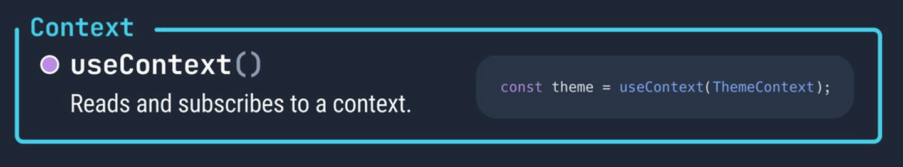

# REACT

Class: FRONTEND

Notes: Hook useContext

The useContext is a React Hook that lets you read and subscribe to context from your component. In other words, this hook allows you to share states among components.



```jsx
const value = useContext(SomeContext)
```

Context works similarly to props, but instead of providing data to a single child, it can be used to provide data to an entire subtree.

:::{.callout-important collapse="false"}
## This is important

Context can only send data down the tree (parent to subtree). It can be paired with callback functions to pass data back up.

:::