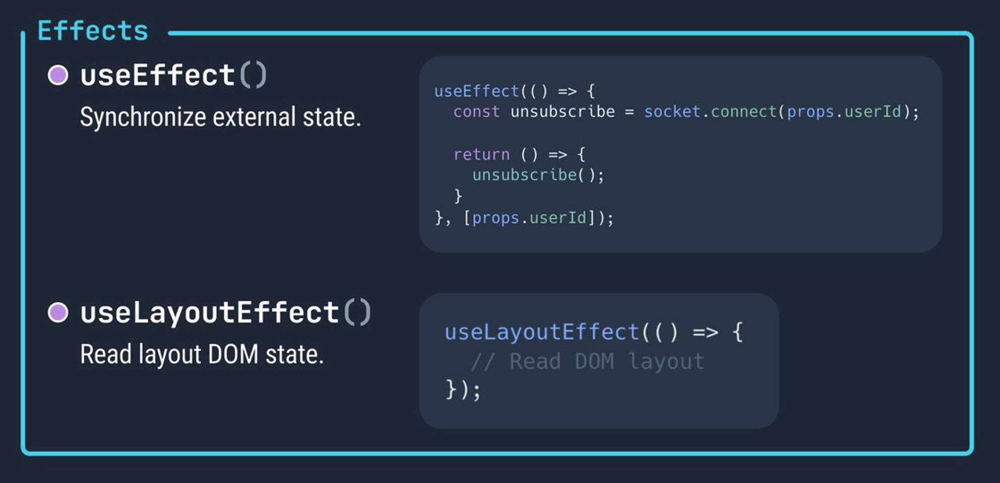
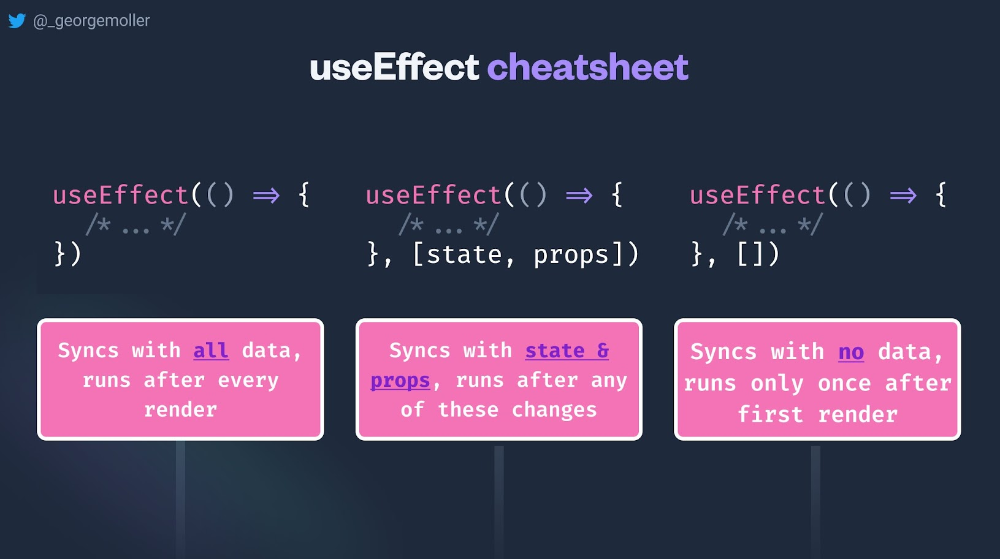

# REACT

Class: FRONTEND

Notes: Hook useEffect

The hook useEffect allows you to perform side effects in your components. In other words, synchronization with other components. Some examples of side effects are: fetching data, directly updating the DOM, and timers. If you’re not trying to synchronize with some external system, you probably don’t need an Effect.



The useEffect accepts two arguments. The second argument is optional.

```jsx
useEffect(setup, dependencies?)
```

### Parameters

- **setup:** The function with your Effect’s logic.
- **optional dependencies:** The list of all reactive values referenced inside of the setup code.
Reactive values include** props, state, and all the variables and functions declared directly inside your component bod**y.

