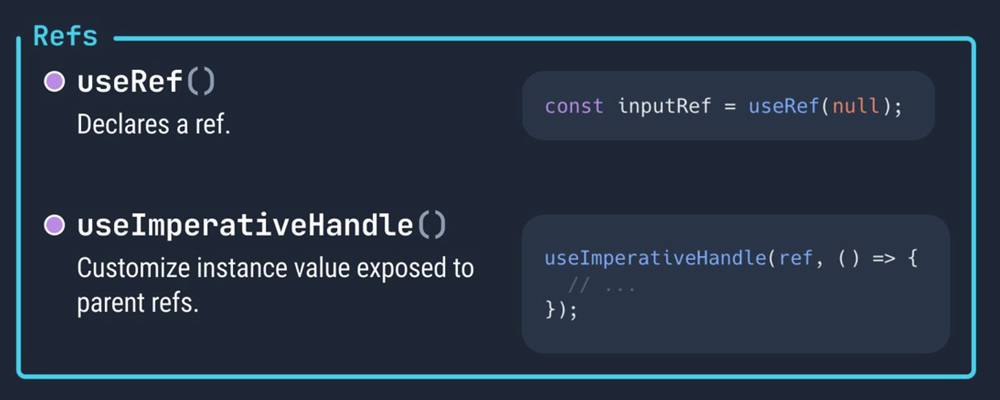

# REACT

Class: FRONTEND

Notes: Hook useRef

The useRef is a React Hook that lets you reference a value that’s not needed for rendering: allows you to persist values between renders. In other words, persistence between renders.

```jsx
const ref = useRef(initialValue)
```

### Parameters

- **initialValue**: The value you want the ref object’s current property to be initially. It can be a value of any type. This argument is ignored after the initial render.

### Returns

- **useRef** returns an object with a single property: **current:** Initially, it’s set to the initialValue you have passed. You can later set it to something else. If you pass the ref object to React as a ref attribute to a JSX node, React will set its current property.

