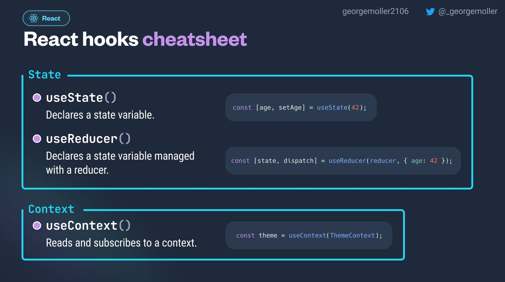
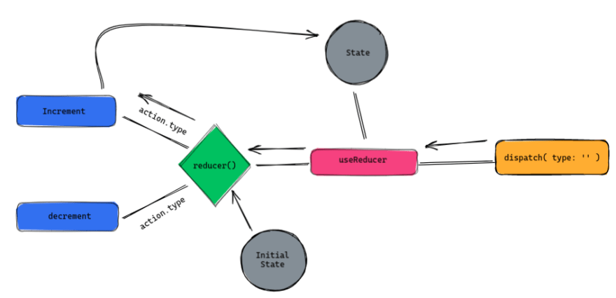
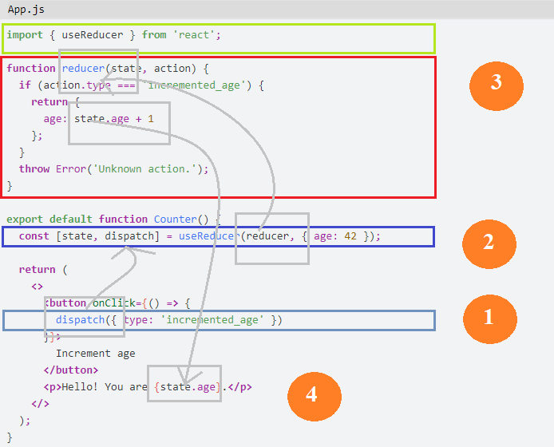

# REACT

Class: FRONTEND

Notes: Hooks useState & useReducer

# RULE #1: Only Call Hooks at the Top Level

<aside>
❗

Don’t call Hooks inside loops, conditions, or nested functions.

</aside>

Always use Hooks at the top level of your React function, before any early returns.

By following this rule, you ensure that Hooks are called in the same order each time a component renders.

That’s what allows React to correctly preserve the state of Hooks between multiple useState and useEffect calls.

# RULE #2: Only Call Hooks from React Functions

<aside>
❗

Don’t call Hooks from regular JavaScript functions. Instead, you can:

</aside>

Call Hooks from React function components.
Call Hooks from custom Hooks

## The useState Hook

The useState is a React Hook that lets you add a state variable to your component.

In few words, allows synchronization, manage simple variables and objects.

```jsx
const [state, setState] = useState(initialState)
```

The useState hook takes a single argument, which is the initial state for the state variable. In the example above:

1. **initialState** is the value you want the state to be initially. It can be a value of any type, but there is a special behavior for functions. This argument is ignored after the initial render.
2. **useState** returns an array with exactly two values:
    - **state**: The current state. During the first render, it will match the initialState you have passed.
    - **setState**: The set function that lets you update the state to a different value and trigger a re-render.
    
    
    

## The useReducer Hook

The useReducer is a React Hook that lets you add a reducer to your component.

It is normally to used manage complexity, volume, and a lot of cases and operations

### Parameters

- **reducer:** The reducer function that specifies how the state gets updated. It must be pure, should take the state and action as arguments, and should return the next state. State and action can be of any types.
- **initialArg:** The value from which the initial state is calculated. It can be a value of any type. How the initial state is calculated from it depends on the next init argument.
- **optional init:** The initializer function that specifies how the initial state is calculated. If it’s not specified, the initial state is set to initialArg. Otherwise, the initial state is set to the result of calling init(initialArg).

```jsx
const [state, dispatch] = useReducer(reducer, initialArg, init?)
```

### dispatch function

The useReducer returns an array with exactly two values:

1. The current state. During the first render, it’s set to init(initialArg) or initialArg (if there’s no init).
2. The dispatch function that lets you update the state to a different value and trigger a re-render.

A reducer is a function that takes in the current state of an application and an action, and returns a new state.

```jsx
function reducer(state, action) {
  switch (action.type) {
    case 'INCREMENT':
      return { count: state.count + 1 };
    case 'DECREMENT':
      return { count: state.count - 1 };
    default:
      return state;
  }
}
```

In this example, the reducer function takes in a state object and an action object, and returns a new state based on the action type.

- If the action type is INCREMENT, the reducer increments the count property of the state and returns the new state.
- If the action type is DECREMENT, the reducer decrements the count property and returns the new state.
- If the action type is not recognized, the reducer returns the current state without making any changes



