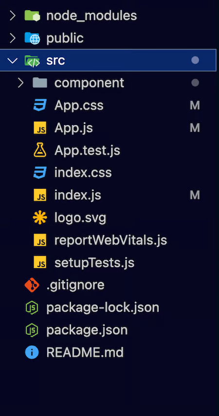

# REACT

Class: FRONTEND

Notes: React-Router-DOM

The React Router DOM is a collection (npm package) of navigational components for handling routing in React applications.

React applications that allows developers to declarative define the application's UI based on the URL to implement dynamic routing and manage navigation between different views without needing to reload the page, promoting a smooth user experience. The library uses a declarative approach to routing, making it efficient and straightforward to handle navigation in React applications.

This tool provides a way to synchronize the UI with the URL, enabling client-side routing in single-page applications (SPAs).

The react-router-DOM is an important library that allows you to navigate between different components and manage the browser history.

React Router Dom is used to build single-page applications (SPA) i.e. applications that have many pages or components but the page is never refreshed instead the content is dynamically fetched based on the URL.

The major advantage of react-router is that the page does not have to be refreshed when a link to another page is clicked, for example. Moreover, it is fast, very fast compared to traditional page navigation. This means that the user experience is better and the app has overall better performance.

The Route component takes 2 parameters. The first one is the path that will be in the URL and the second is the component that will be displayed if the current URL matches the path in the first parameter.

The directory react-router-example will be created. If you cd into it, you should see a structure similar to the following:

