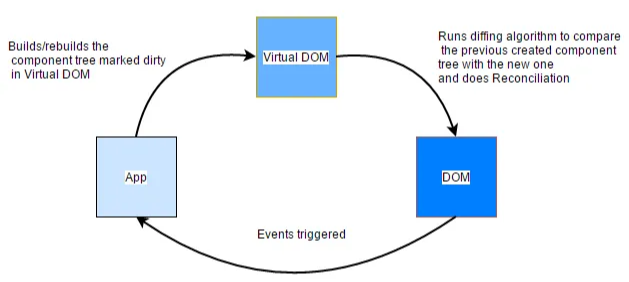
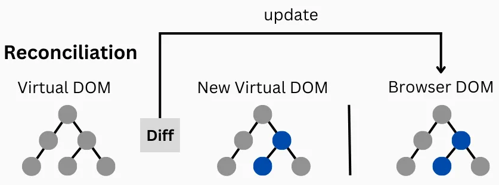

# REACT

Class: FRONTEND

Notes: Render Virtual DOM

The Document Object Model (DOM) is a **programming interface (UI, user interface)** for web documents. It represents the web page so that programs can change the document structure, style, and content. A web page is a document that can be either displayed in the browser window or as the HTML source. In both cases, it is the same document but the Document Object Model (DOM) representation allows it to be manipulated.

The Virtual DOM (VDOM) is a pivotal concept in modern web development, particularly leveraged by JavaScript libraries like React. It serves **as an abstract, lightweight copy of the actual Document Object Model (DOM)**, the structural representation of a webpage.

The virtual DOM Model (DOM) serves as an intermediary between the actual DOM and the application, **allowing for efficient updates without directly manipulating the real DOM.** Instead of manipulating the browser’s DOM directly, React creates a virtual DOM in memory, where it does all the necessary manipulating, before making the changes in the real browser DOM.

The purpose of the VDOM is to optimize rendering and enhance performance by minimizing direct manipulation of the real DOM. Changes are processed on this virtual representation first, reducing unnecessary updates on the real web page.

Therefore, when changes occur, the virtual DOM is updated first, updating only the necessary parts through a method called "diffing" and reconciliation, and then it efficiently syncs ONLY those changes with the real DOM, enhancing the overall efficiency and user experience. This optimization helps improve performance by minimizing costly DOM operations and ensuring only necessary updates are made.