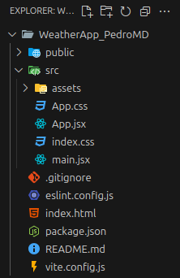

# Starting a REACT project from scratch

The first thing is to go to <https://vite.dev/guide/> to create a react project with Vite using a template.
The code to generate the react template is:

```java
npm create vite@latest my-vue-app -- --template react
```
Create a folder where the project will be hosted. Next, open that folder with Visual Studio Code.
In the VSC terminal, paste the above command and run it to create the react project scaffoldings. This command should be copied and the words *my-vue-app* changed with the name of the project to work on.
Before running this command, the package **create-vite@6.3.0** should be installed. If not, the terminal will ask you to install itself for you.

Afterward, the react skeleton will be shown in the VSC explorer as shown below:



 Next, npm should be installed **but** within the project folder, so that it will be need to go with the terminal one more folder below as shown in the picture below:

 

 After the npm installation, the folder structure has changed with two new files: node-modules and package-lock.json whih have been created by npm.

 